# POET & POET-X

**Reparameterized LLM Training via Orthogonal Equivalence Transformation**

[](https://arxiv.org/abs/2506.08001)
[](https://neurips.cc/virtual/2025/poster/118691)
[](https://spherelab.ai/poet/)
[](https://spherelab.ai/poetx/)

> Zeju Qiu, Simon Buchholz, Tim Z. Xiao, Maximilian Dax, Bernhard Schölkopf, Weiyang Liu  
> *Max Planck Institute for Intelligent Systems, Tübingen · The Chinese University of Hong Kong*

---

## Overview

This repository contains the official implementation of **POET** and **POET-X** — a family of reparameterized LLM training algorithms that optimize weight matrices through **Orthogonal Equivalence Transformation (OET)**, achieving superior generalization with provably bounded weight spectra.

<p align="center">
  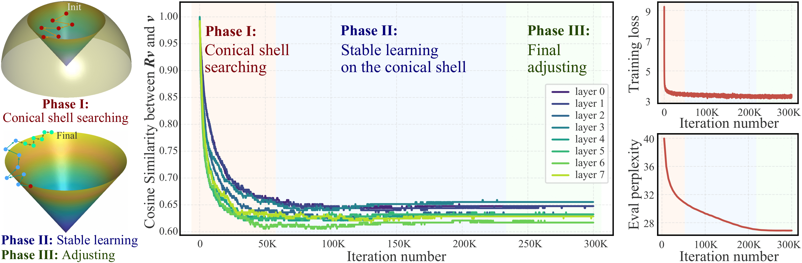
  <br><em>POET's three learning phases: conical shell searching → stable learning → final adjusting.</em>
</p>

---

## POET

### Method

POET reparameterizes each weight matrix as:

$$W_{RP} = R \, W_0 \, P$$

where $W_0 \in \mathbb{R}^{m \times n}$ is a **fixed** randomly initialized matrix, and $R \in \mathbb{R}^{m \times m}$, $P \in \mathbb{R}^{n \times n}$ are **learnable orthogonal matrices**. Training only updates $R$ and $P$, leaving $W_0$ unchanged.

**Why orthogonal transformations?** They preserve singular values exactly — giving POET direct, provable control over the weight spectrum throughout training.

<p align="center">
  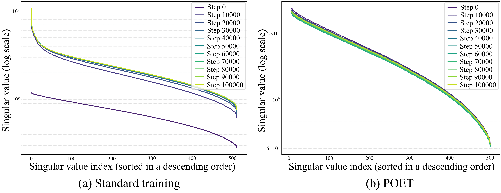
  <br><em>Dynamics of singular values: POET (right) avoids the large singular value growth seen in standard AdamW training (left).</em>
</p>

### Spectral Diversity

<p align="center">
  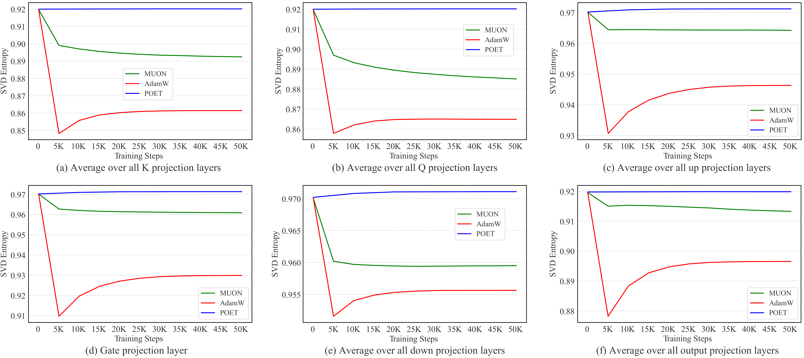
  <br><em>POET maintains consistently higher SVD entropy (singular value diversity) throughout training compared to AdamW and Muon.</em>
</p>

### Energy & Spectrum Preservation

<p align="center">
  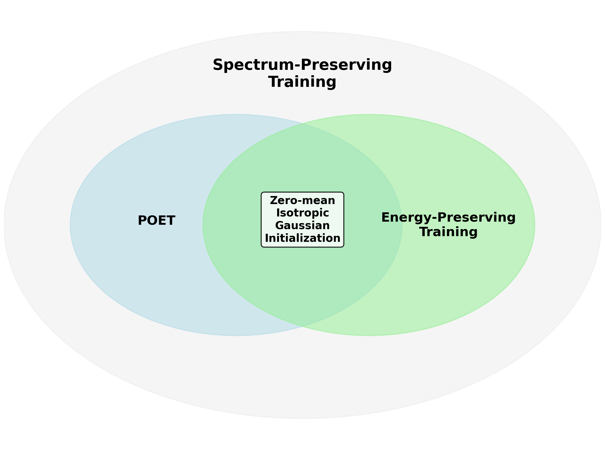
  <br><em>POET with normalized Gaussian initialization simultaneously preserves both hyperspherical energy and the weight spectrum — explaining its strong generalization.</em>
</p>

### Efficient Approximation: Stochastic Primitive Optimization (SPO)

Large orthogonal matrices $R \in \mathbb{R}^{m \times m}$ are expensive to optimize naively. POET introduces two efficient variants:

- **POET-FS** (Fully Stochastic SPO): Randomly samples a small $b \times b$ submatrix at each step. Highly parameter-efficient; decouples parameter count from matrix size.
- **POET-BS** (Block-Stochastic SPO): Block-diagonal structure with random permutations; transforms all dimensions simultaneously. More expressive per parameter.

<p align="center">
  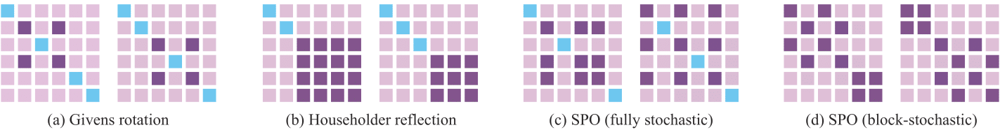
  <br><em>Weight update coverage: POET-BS achieves more even updates across all weight elements compared to POET-FS.</em>
</p>

Orthogonal matrices are parameterized via **Cayley-Neumann Parameterization (CNP)**, which approximates the matrix inverse using a truncated Neumann series for numerical stability:

$$R = (I + Q)(I - Q)^{-1} \approx (I + Q)\left(I + \sum_{i=1}^{k} Q^i\right)$$

A **merge-then-reinitialize** trick periodically absorbs $R, P$ into $W_0$, preventing error accumulation and keeping the Neumann series convergent.

### Results

<p align="center">
  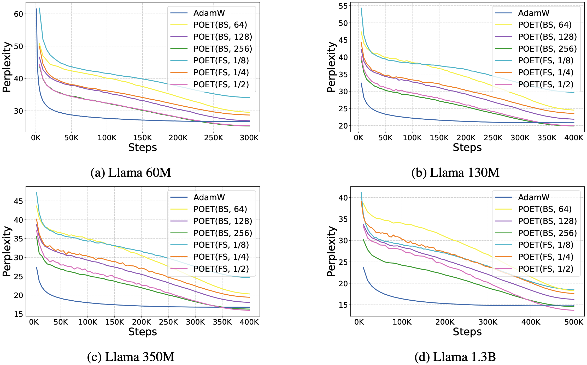
  <br><em>POET outperforms AdamW with significantly fewer trainable parameters across all LLaMA model sizes on C4.</em>
</p>

| Method | Params | 60M PPL | 130M PPL | 350M PPL | 1.3B PPL |
|---|---|---|---|---|---|
| AdamW | Full | 26.68 | 20.82 | 16.78 | 14.73 |
| GaLore | Full | 29.81 | 22.35 | 17.99 | 18.33 |
| LoRA (r=64) | ~5% | 39.70 | 32.07 | 25.19 | 20.55 |
| POET-BS (b=128) | ~13% | **26.90** | **21.86** | **18.05** | **16.24** |
| POET-BS (b=256) | ~26% | **25.29** | **19.88** | **16.27** | **14.56** |

<p align="center">
  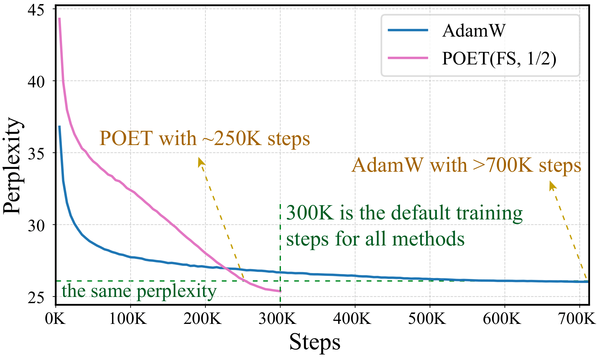
  <br><em>POET-FS (b=1/2) still outperforms AdamW even when AdamW is trained with ~3× more tokens.</em>
</p>

**Parameter budget allocation:**
<p align="center">
  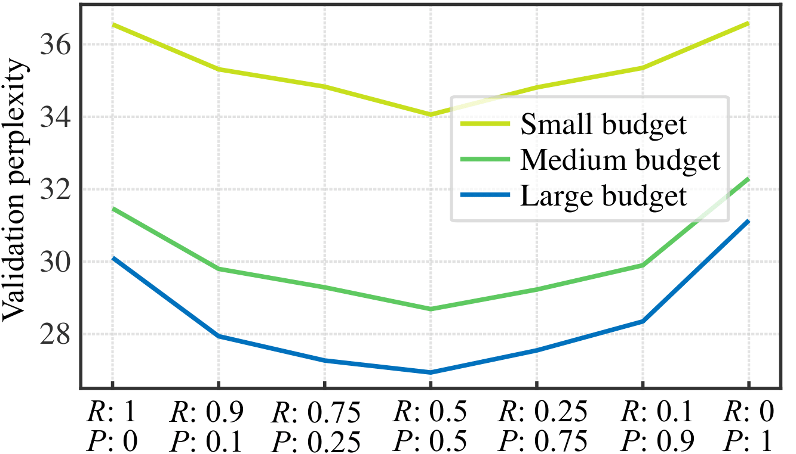
  <br><em>Balanced allocation between R and P consistently yields the best validation perplexity.</em>
</p>

---

## POET-X

### Overview

POET-X is a **scalable, memory-efficient** variant of POET that makes orthogonal equivalence training practical at the billion-parameter scale.

> The original POET must store the full transformed weight $RW_0P$ for backpropagation, making it **more memory-intensive than AdamW**. POET-X resolves this through a suite of engineering innovations.

### Key Results

<p align="center">
  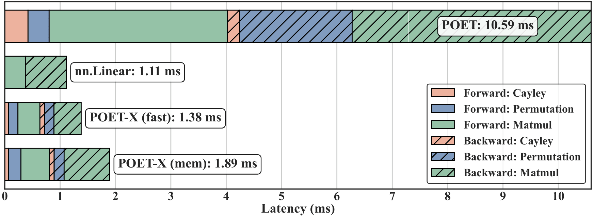
  <br><em>Latency breakdown: POET-X reduces forward+backward latency from 10.59ms (POET) to 1.38ms (POET-Xfast), approaching standard linear layers.</em>
</p>

<p align="center">
  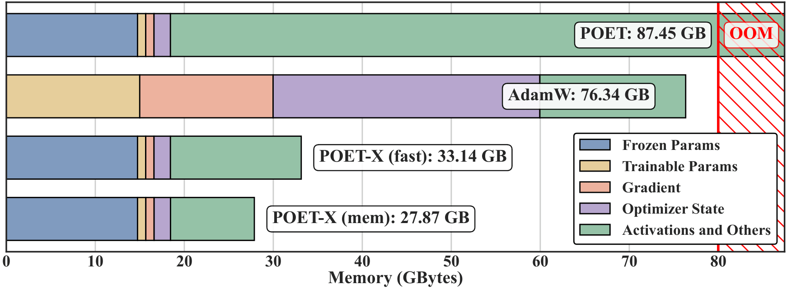
  <br><em>Memory breakdown for Llama-8B training on a single GPU. POET-X_mem achieves PEFT-level memory; POET runs OOM.</em>
</p>

### Pretraining Results

<p align="center">
  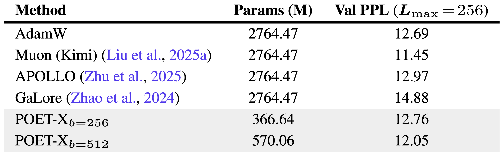
  <br><em>Llama-3B pretraining on 60B C4 tokens: POET-X achieves better PPL than AdamW and all memory-efficient baselines.</em>
</p>

<p align="center">
  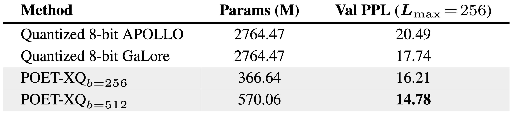
  <br><em>POET-XQ (quantized): Best PPL of 14.78 with minimal memory footprint, outperforming GaLore and APOLLO.</em>
</p>

Training dynamics with different block sizes:

<p align="center">
  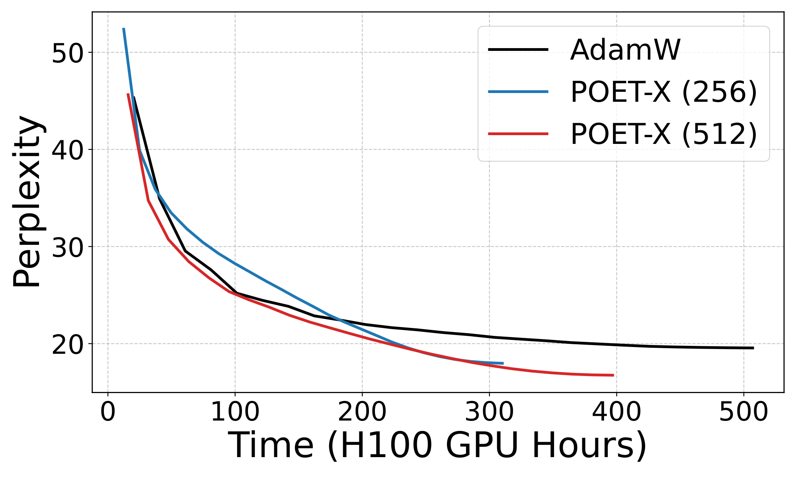
  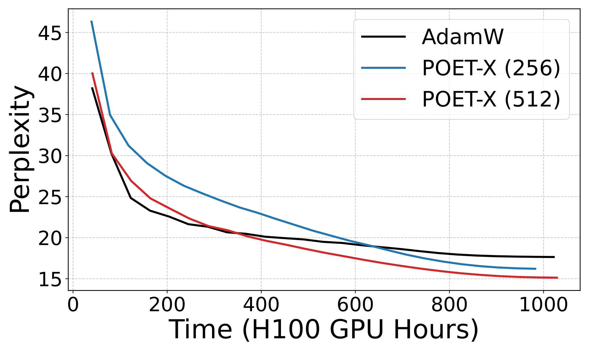
  <br><em>Validation PPL curves at block size b=256 (left) and b=1024 (right).</em>
</p>

### Memory Efficiency

<p align="center">
  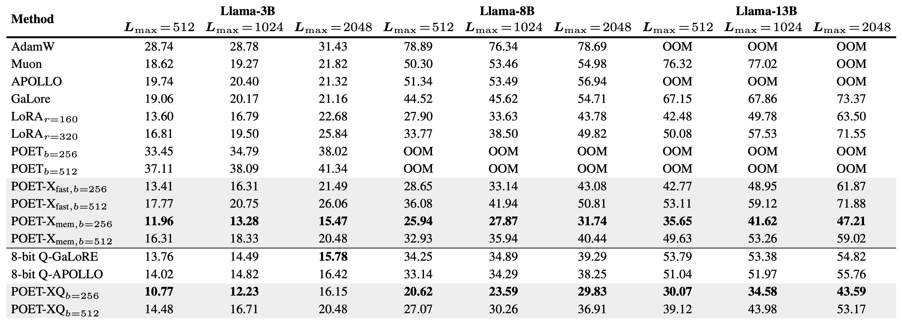
  <br><em>Peak GPU memory across model sizes (3B–13B) and sequence lengths: POET-X_mem outperforms all baselines including LoRA.</em>
</p>

### Throughput & Distributed Scaling

<p align="center">
  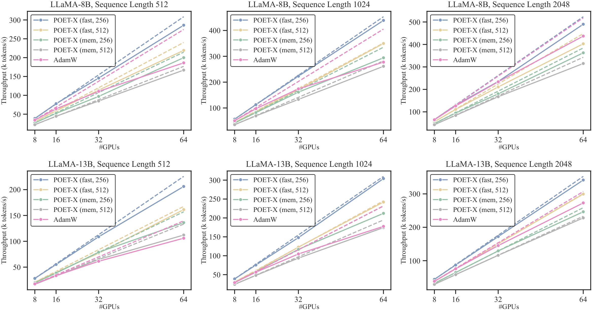
  <br><em>POET-X closely follows ideal linear scaling on 64× H100s, while AdamW (FSDP) plateaus due to communication overhead.</em>
</p>

<p align="center">
  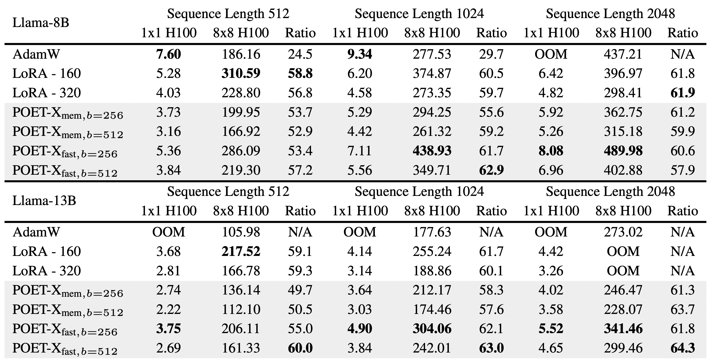
</p>

### Method: Key Optimizations

The core insight is an **input-centric formulation** that avoids materializing the full $m \times n$ transformed weight:

$$z = \underbrace{\Phi_n G_P^\top \Phi_n^\top}_{P^\top} W \underbrace{\Phi_m G_R^\top \Phi_m^\top}_{R^\top} x$$

This reduces complexity from $O(nm^2)$ to a sequence of matrix-vector products.

Four engineering innovations:

1. **Permutation Acceleration** — Custom CUDA kernels for index-mapped permutations (up to **20× speedup**).
2. **Permutation Reduction** — Pre-computes permuted weights once per inner loop, eliminating redundant ops.
3. **Batch-Parallel Strategy** — Treats each block of block-diagonal $G_P$, $G_R$ as an independent batch element; avoids large sparse matrix construction.
4. **Fused Cayley-Neumann Kernels** — Triton kernel loads $Q$ and $Q^2$ into shared memory once for all terms; backward pass also fused.

<p align="center">
  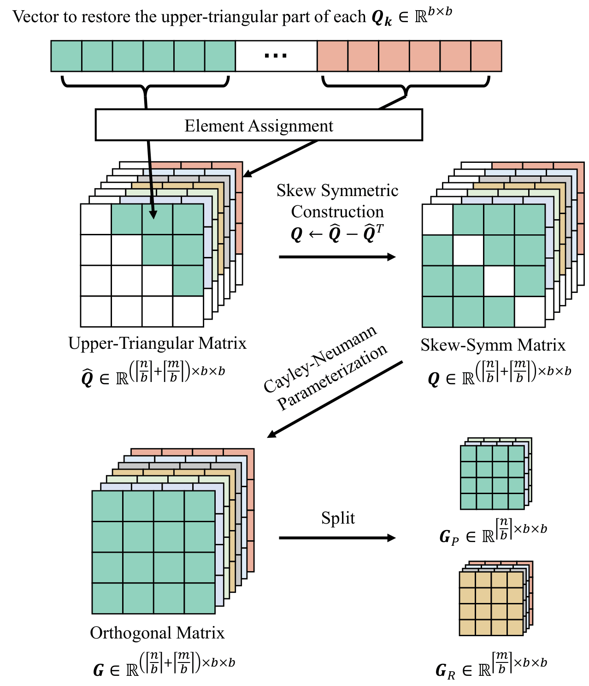
  <br><em>Fused Cayley-Neumann parameterization: batch-wise implementation via Triton kernel fusion.</em>
</p>

### POET-X Variants

| Variant | Memory | Speed | Notes |
|---|---|---|---|
| `POET-X_fast` | Medium | Fast | Standard autograd, saves activation $b$ |
| `POET-X_mem` | **Lowest** | Moderate | Gradient checkpointing, recomputes $b$ on-the-fly |
| `POET-X_Q` | **Lowest** | High throughput | INT8 quantized base weights, dequantized on-the-fly |

---

## Installation

```bash
git clone https://github.com/<your-org>/poet.git
cd poet
pip install -e .
```

**Requirements:**
- Python ≥ 3.9
- PyTorch ≥ 2.0
- CUDA ≥ 11.8
- Triton ≥ 2.0 (for POET-X fused kernels)

---

## Usage

### POET — LLM Pretraining

```python
from poet import POETConfig, wrap_model_with_poet

config = POETConfig(
    variant="block_stochastic",  # "block_stochastic" (POET-BS) or "fully_stochastic" (POET-FS)
    block_size=128,              # Sampling budget b
    neumann_terms=5,             # Cayley-Neumann approximation order
    merge_interval=100,          # Steps between merge-then-reinitialize
)

model = ...  # Your LLaMA / transformer model
model = wrap_model_with_poet(model, config)

optimizer = torch.optim.Adam(model.parameters(), lr=1e-3)
```

### POET-X — Memory-Efficient Large-Scale Training

```python
from poetx import POETXConfig, wrap_model_with_poetx

config = POETXConfig(
    block_size=256,    # Block size b
    variant="mem",     # "fast" | "mem" (gradient checkpointing)
    quantized=False,   # Set True for POET-XQ (INT8 base weights)
)

model = wrap_model_with_poetx(model, config)

# Works with standard DDP (no FSDP needed)
model = torch.nn.parallel.DistributedDataParallel(model)
```

### Training Script

```bash
# Pretrain LLaMA-130M with POET-BS (b=128) on C4
python train.py \
    --model_size 130M \
    --method poet_bs \
    --block_size 128 \
    --dataset c4 \
    --max_tokens 40B

# Pretrain LLaMA-3B with POET-X_mem on C4
python train.py \
    --model_size 3B \
    --method poetx_mem \
    --block_size 512 \
    --dataset c4 \
    --max_tokens 60B
```

### Merge Weights for Inference

After training, orthogonal matrices merge into base weights — **zero inference overhead**:

```python
from poet import merge_poet_weights

model = merge_poet_weights(model)  # W ← R W_0 P
model.save_pretrained("./my-pretrained-llm")
```

---

## Citation

```bibtex
@article{qiu2025poet,
  title={Reparameterized LLM Training via Orthogonal Equivalence Transformation},
  author={Qiu, Zeju and Buchholz, Simon and Xiao, Tim Z. and Dax, Maximilian and Sch{\"o}lkopf, Bernhard and Liu, Weiyang},
  journal={arXiv preprint arXiv:2506.08001},
  year={2025}
}
```

---

## Related Work

- [OFT](https://github.com/Zeju1997/oft) — Orthogonal Finetuning for diffusion models  
- [GaLore](https://github.com/jiaweizzhao/GaLore) — Gradient low-rank projection  
- [Muon](https://github.com/KellerJordan/Muon) — Gradient orthogonalization optimizer  
